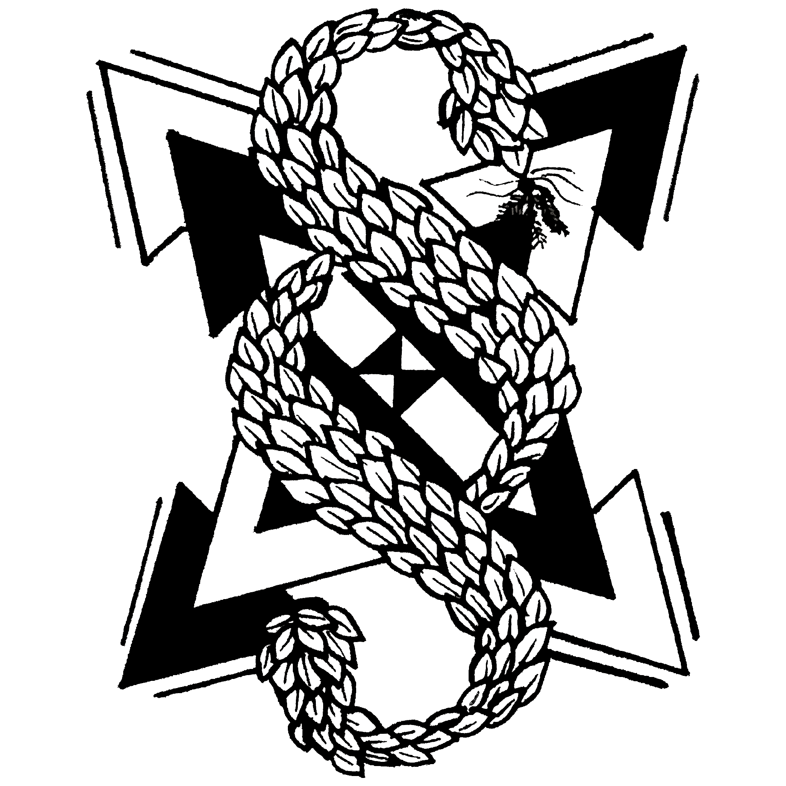

* [check samsesh.net](https://samsesh.net) / [twitter](https://twitter.com/_samsesh) / [instagram](https://instagram.com/sam.sesh) / [clubhouse](https://clubhouse.com/@sam.sesh) 

 

## [donate](https://github.com/samsesh/donate) 
*  |  |  
